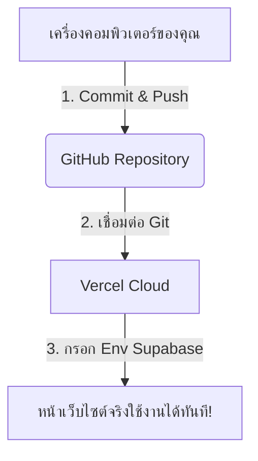

# คู่มือการ Deploy ระบบ PBPVC Canteen ขึ้น Vercel (Supabase 100%) 🚀

หลังจากที่เราเปลี่ยนโครงสร้างระบบไปใช้งาน **Supabase แบบ 100% (Serverless)** และลบ PHP Backend ออกแล้ว ขั้นตอนการ Deploy จะสะดวก ง่ายดาย และฟรี 100% โดยสรุปแผนได้ดังนี้:

---

## 📋 แผนการทำงานใหม่ (เมื่อไม่มี PHP Backend)


---

## ขั้นตอนการ Deploy หน้าเว็บจริง

### วิธีที่ 1: Deploy ผ่าน GitHub (แนะนำและดีที่สุด ⭐)
วิธีนี้เมื่อคุณแก้ไขโค้ดที่เครื่องตนเองและ Push ขึ้น GitHub ทาง Vercel จะอัปเดตหน้าเว็บจริงให้คุณโดยอัตโนมัติทันที

1. **เตรียมโค้ดขึ้น GitHub**:
   - นำโฟลเดอร์ `backend` เดิมออกไป (ลบโฟลเดอร์ออกได้เลย)
   - อัปโหลดโค้ดทั้งหมด (โดยเฉพาะโฟลเดอร์ `frontend`) ขึ้นไปยัง GitHub Repository ของคุณ
2. **เข้าสู่ระบบ Vercel**:
   - ไปที่ [vercel.com](https://vercel.com/) และลงชื่อเข้าใช้งานด้วยบัญชี GitHub ของคุณ
3. **สร้างโครงการใหม่**:
   - กดปุ่ม **"Add New"** -> เลือก **"Project"**
   - ค้นหาและกดปุ่ม **"Import"** ที่ตัว Repository ของระบบนี้
4. **ตั้งค่าคอนฟิกรูทโฟลเดอร์ (Root Directory)**:
   - สังเกตที่หัวข้อ **"Root Directory"** -> ให้กดปุ่ม **"Edit"** แล้วคลิกเลือกโฟลเดอร์ `frontend` (เนื่องจากโฟลเดอร์ Next.js อยู่ด้านในนั้น)
5. **กรอกค่า Environment Variables**:
   - กดคลี่แท็บ **Environment Variables** ออกมา แล้วนำค่าจากไฟล์ `.env.local` มากรอกลงไป:
     
     | Key | Value | คำอธิบาย |
     | :--- | :--- | :--- |
     | `NEXT_PUBLIC_SUPABASE_URL` | *(นำค่ามาจากไฟล์ .env.local ของคุณ)* | URL ของระบบ Supabase |
     | `NEXT_PUBLIC_SUPABASE_ANON_KEY` | *(นำค่ามาจากไฟล์ .env.local ของคุณ)* | Key สำหรับให้ Next.js เขียน/อ่านฐานข้อมูล |

     > [!NOTE]
     > ตอนนี้เรา**ไม่จำเป็น**ต้องใส่ `NEXT_PUBLIC_API_URL` อีกต่อไปแล้วเนื่องจากไม่มี PHP API แล้ว!

6. **กดปุ่ม Deploy**:
   - รอ Vercel ทำการ Build ระบบประมาณ 1-2 นาที เมื่อเสร็จแล้วคุณจะได้ลิงก์เว็บไซต์จริง (เช่น `https://pbpvc-canteen.vercel.app`) ที่ทุกคนสามารถเข้าถึงและใช้งานได้ทันที!

---

### วิธีที่ 2: Deploy ผ่าน Vercel CLI (ทางเลือก)
หากเชื่อมโยงในโฟลเดอร์โปรเจกต์เดิมที่มีอยู่แล้ว:
1. เปิด Terminal ในเครื่องคอมพิวเตอร์ของคุณ แล้วเข้าไปที่โฟลเดอร์ `frontend`:
   ```bash
   cd frontend
   ```
2. ดำเนินการ Deploy ครั้งแรกเพื่อตรวจสอบ:
   ```bash
   vercel
   ```
3. เมื่อตรวจสอบเรียบร้อยแล้ว ให้ปล่อยระบบขึ้นเว็บหลักด้วยคำสั่ง:
   ```bash
   vercel --prod
   ```
4. อย่าลืมตรวจสอบค่า **Environment Variables** บนหน้าเว็บตั้งค่าของ Vercel (เมนู Settings -> Environment Variables) ให้ตรงกับระบบด้วยนะครับ

---

🎉 **ยินดีด้วยครับ! ตอนนี้ทั้งเว็บไซต์และฐานข้อมูลของคุณออนไลน์อยู่บน Cloud แบบ 100% แล้ว** สามารถใช้งานระบบสั่งซื้ออาหาร เมนู ร้านค้า และเข้าสู่ระบบในชื่อแม่ค้า/นักเรียนได้เลย!
