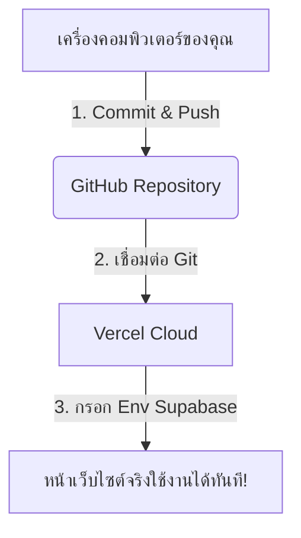

# คู่มือการ Deploy ระบบ PBPVC Canteen ขึ้น Vercel (Supabase 100% - Root Directory) 🚀

หลังจากที่เราย้ายไฟล์ทั้งหมดใน `frontend` ออกมาอยู่ด้านนอกสุด (Root Directory) ของโปรเจกต์ และทำงานผ่าน **Supabase แบบ 100%** แล้ว การ Deploy ขึ้นเว็บจริงจะง่ายและไม่มีปัญหาโฟลเดอร์ทับซ้อนอีกต่อไปครับ!

---

## 📋 แผนการทำงานใหม่


---

## ขั้นตอนการ Deploy หน้าเว็บจริง

### วิธีที่ 1: Deploy ผ่าน GitHub (แนะนำและดีที่สุด ⭐)

1. **ส่งโค้ดล่าสุดขึ้น GitHub**:
   - เนื่องจากเราย้ายไฟล์มาอยู่ด้านนอกและรันสำเร็จแล้ว ให้ Push โค้ดทั้งหมดขึ้น GitHub
2. **เข้าสู่ระบบ Vercel**:
   - ไปที่ [vercel.com](https://vercel.com/) และลงชื่อเข้าใช้งานด้วยบัญชี GitHub ของคุณ
3. **สร้างโครงการใหม่**:
   - กดปุ่ม **"Add New"** -> เลือก **"Project"**
   - ค้นหาและกดปุ่ม **"Import"** ที่ตัว Repository ของระบบนี้
4. **ตั้งค่าคอนฟิกรูทโฟลเดอร์ (Root Directory)**:
   - **สำคัญมาก:** เนื่องจากเราย้ายไฟล์ออกมาด้านนอกสุดแล้ว ในหัวข้อ **"Root Directory"** ให้ปล่อยเป็นค่าเริ่มต้น หรือระบุเป็น **`.` (Root)** ได้เลยครับ! (ไม่ต้องเลือก `frontend` อีกต่อไปแล้ว)
5. **กรอกค่า Environment Variables**:
   - กดคลี่แท็บ **Environment Variables** ออกมา แล้วนำค่าจากไฟล์ `.env.local` มากรอกลงไป:
     
     | Key | Value | คำอธิบาย |
     | :--- | :--- | :--- |
     | `NEXT_PUBLIC_SUPABASE_URL` | *(นำค่ามาจากไฟล์ .env.local ของคุณ)* | URL ของระบบ Supabase |
     | `NEXT_PUBLIC_SUPABASE_ANON_KEY` | *(นำค่ามาจากไฟล์ .env.local ของคุณ)* | Key สำหรับให้ Next.js เขียน/อ่านฐานข้อมูล |

6. **กดปุ่ม Deploy**:
   - รอ Vercel ทำการ Build ระบบประมาณ 1-2 นาที เมื่อเสร็จแล้วคุณจะได้ลิงก์เว็บไซต์จริง (เช่น `https://pbpvc-canteen.vercel.app`) ที่ทุกคนสามารถเข้าถึงและใช้งานได้ทันที!

---

### วิธีที่ 2: Deploy ผ่าน Vercel CLI (ทางเลือก)
หากทำผ่าน Command Line:
1. เปิด Terminal ในเครื่องคอมพิวเตอร์ของคุณ ในโฟลเดอร์นอกสุดของโปรเจกต์
2. ดำเนินการ Deploy ครั้งแรกเพื่อตรวจสอบ:
   ```bash
   vercel
   ```
3. เมื่อตรวจสอบเรียบร้อยแล้ว ให้ปล่อยระบบขึ้นเว็บหลักด้วยคำสั่ง:
   ```bash
   vercel --prod
   ```
4. อย่าลืมตรวจสอบค่า **Environment Variables** บนหน้าเว็บตั้งค่าของ Vercel (เมนู Settings -> Environment Variables) ให้ตรงกับระบบด้วยนะครับ

---

🎉 **ยินดีด้วยครับ! ตอนนี้ระบบของคุณจัดระเบียบเรียบร้อยแล้วและพร้อมออนไลน์บน Cloud ได้ทันที!**
