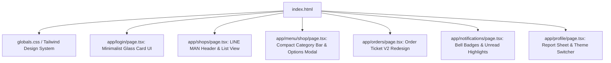
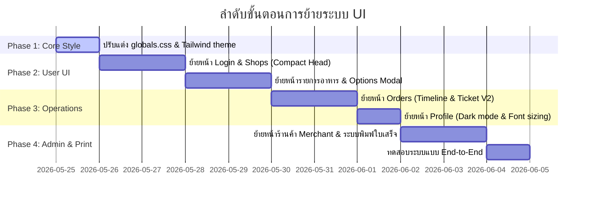

# 🗺️ แผนการย้ายระบบ UI (index.html ➡️ Next.js + Tailwind CSS)

เอกสารนี้ระบุแผนการดำเนินการอย่างละเอียดเพื่อเปลี่ยนรูปแบบหน้าเว็บ (Frontend) ของระบบ Next.js ปัจจุบัน ให้มีหน้าตา สไตล์ และฟังก์ชันการทำงานตรงตามรูปแบบ **Premium LINE MAN Style & 2024 Redesign** ที่อยู่ในไฟล์ `d:\patcharapol\pbpvccanteen\appscript\index.html` ทั้งหมด โดยมีการผสมผสานพลังของ Next.js, React และ Tailwind CSS

---

## 🎨 1. การถ่ายโอน Design System และ Global Styles

ไฟล์ `index.html` ของระบบเดิมใช้ Bootstrap 5 ร่วมกับ Custom CSS สำหรับ Next.js เราจะใช้ **Tailwind CSS** ในการสร้างสไตล์เดียวกัน เพื่อความรวดเร็วและประสิทธิภาพที่ดีขึ้น

### 📌 สิ่งที่ต้องดำเนินการใน `src/app/globals.css`
*   **Color Tokens**: ย้ายรหัสสีพรีเมียมจาก `:root` ใน `index.html` มาเป็น CSS variables ใน Tailwind:
    *   `--primary`: `#006837` (เขียวมรกตต้นตำรับ)
    *   `--primary-light`: `#00a568` / `#36c990` (เขียวสว่างสำหรับ Compact header และ Hover)
    *   `--bg-main`: `#f4f7f9` (สีเทาอมฟ้าสบายตา)
    *   **Status Colors**:
        *   Waiting: สีส้มอ่อน `#ffebee` / ตัวหนังสือ `#c62828`
        *   Cooking: สีฟ้าอ่อน `#e3f2fd` / ตัวหนังสือ `#1976d2`
        *   Ready: สีเขียวอ่อน `#e8f5e9` / ตัวหนังสือ `#2e7d32`
*   **Glassmorphism & Shadows**: นิยามคลาส `.glass-card` และเงา `.card-shadow` ที่นุ่มนวลลอยตัว
*   **Dark Mode (โหมดมืด)**: รองรับ `[data-theme="dark"]` หรือคลาส `dark:` ของ Tailwind เพื่อสลับสีเป็น `#121212` และ `#1e1e1e` โดยอัตโนมัติ
*   **Font Customization**: ย้ายระบบขยายฟอนต์ (`font-sm`, `font-md`, `font-lg`) ที่ย่อ/ขยายขนาดตัวหนังสือได้ผ่าน Setting

---

## 🛠️ 2. แผนการย้ายรายหน้า (Page-by-Page Migration Plan)

เราจะพอร์ตการออกแบบการ์ดและเลย์เอาต์ทั้งหมดมายังโฟลเดอร์ `src/app/` ของ Next.js:

---

### 🟢 2.1 หน้าล็อกอิน (Authentication - `/login`)
*   **การออกแบบเดิม**: กล่องล็อกอินแบบกลมกลืน ลอยตัวบนพื้นหลังเบลอภาพโรงอาหาร
*   **Next.js Implementation**:
    *   ใช้คลาส `.bg-canteen` แสดงรูปภาพ Unsplash ศูนย์อาหารและเบลอพื้นหลังด้วย Backdrop-blur
    *   ใช้กล่อง `.glass-card` ลอยตัวตรงกลางอย่างสวยงาม
    *   ปุ่มกดมี Transition นุ่มนวลและ Scale-down เมื่อคลิก

### 🟢 2.2 หน้าหลักร้านค้า (Shops - `/shops`)
*   **การออกแบบเดิม**: แถบหัวสีเขียวโค้งมนเลื่อนหดได้ (Compact Header) + แบนเนอร์วิ่งข่าวประชาสัมพันธ์ (News Ticker) + รายการร้านอาหารแนวนอน
*   **Next.js Implementation**:
    *   สร้าง **Compact Scroll Event Listener** ในหน้า React: เมื่อผู้ใช้เลื่อนลง หัวจะหดแคบลงและซ่อนรายละเอียดเพื่อเพิ่มพื้นที่การสแกน (Compact Mode)
    *   **News Banner Component**: แสดงแบนเนอร์สีเหลืองด้านบนสุดของร้านค้า พร้อม Animation วิ่งสไลด์
    *   **Shop Grid**: แสดงข้อมูลร้านเปิด-ปิด พร้อมคำนวณเวลาระยะห่างอัติโนมัติ, แสดงเรตติ้งเฉลี่ยและดาว ⭐

### 🟢 2.3 หน้ารายการอาหาร (Menu - `/menu/[shop]`)
*   **การออกแบบเดิม**: Category Bar คล้ายแอปส่งอาหาร (Sticky horizontal scrolling) + เมนูแนวนอนแบบมีปุ่มกลมสีเขียวด้านล่างขวาของภาพ
*   **Next.js Implementation**:
    *   **Sticky Category Tab**: แถบปัดซ้ายขวาแนวนอนสำหรับหมวดหมู่แบบซ่อน scrollbar
    *   **List View Menu Item**: รูปภาพอาหารพร้อมปุ่มบวกลบตรงมุมขวาล่างของรูปภาพเพื่อความสะดวกในการหยิบใส่ตะกร้า (LINE MAN style)
    *   **Options Bottom Sheet**: เมื่อกดเลือกอาหาร จะสไลด์บอร์ดขึ้นมาจากขอบล่างของจอเพื่อสั่งแบบระบุตัวเลือก (Options/คำขอพิเศษ)

### 🟢 2.4 หน้าออเดอร์และการติดตาม (Orders - `/orders`)
*   **การออกแบบเดิม**: การ์ดออเดอร์รูปแบบตั๋วอาหาร (Order Ticket V2 Redesign) แสดงลำดับความคืบหน้า (Timeline step bar)
*   **Next.js Implementation**:
    *   **Order Ticket V2**: ออกแบบกรอบสีทางซ้ายมือตามสถานะออเดอร์ (ส้ม ➡️ ฟ้า ➡️ เขียว ➡️ แดง)
    *   **Timeline Tracker Component**: แถบวงกลมแสดงสถานะความคืบหน้า (รอคิว 🍳 กำลังทำ 🛵 พร้อมเสิร์ฟ) ที่เปลี่ยนสีสว่างตามสถานะจริง
    *   **Receipt Thermal Printing**: นำระบบ `@media print` และคลาส `.receipt-box` สำหรับจำลองกระดาษพิมพ์ใบเสร็จ 58mm/80mm เพื่อให้ร้านค้ากดพิมพ์ใบเสร็จออเดอร์ได้ทันที

### 🟢 2.5 หน้าโปรไฟล์และการตั้งค่า (Profile - `/profile`)
*   **การออกแบบเดิม**: เมนูควบคุมเสียง, ขยายตัวอักษร, สวิตช์เปิด-ปิดโหมดมืด (Dark theme) และบานสไลด์แจ้งเรื่องร้องเรียน/ประวัติออเดอร์
*   **Next.js Implementation**:
    *   สร้างสวิตช์ Toggle โหมดมืดเชื่อมต่อระบบ Class ของ Tailwind CSS (`dark`)
    *   สร้าง Select Box สำหรับปรับขนาดตัวอักษรของระบบ โดยนำไปบันทึกลง LocalStorage และแสดงผลขนาดฟอนต์บน Tag `<body>` ของแอปพลิเคชัน
    *   แผ่นการ์ดด้านล่างเชื่อมต่อบอร์ดแจ้งเรื่องร้องเรียนและประวัติการสั่งซื้อ

---

## 📅 3. แผนการดำเนินงานและขั้นตอนในแต่ละเฟส

เราจะแบ่งการทำงานเป็น **4 เฟส** เพื่อควบคุมและทดสอบความเรียบร้อยของโค้ด:

---

## 🔒 4. จุดที่ต้องระมัดระวัง (Key Considerations)

1.  **Tailwind CSS ➡️ Bootstrap 5 Classes**: หลีกเลี่ยงความขัดแย้งของ CSS โดยการแปลงคลาส Bootstrap ของเดิม (เช่น `d-flex`, `align-items-center`, `col-md-6`) มาเป็น Tailwind ของใหม่ (`flex`, `items-center`, `md:w-1/2`) ทั้งหมด แทนที่จะนำ Bootstrap CDN เข้ามาโหลดเพื่อไม่ให้เว็บอืด
2.  **State Synchronization**: ใช้ Persistent Zustand Store ที่เราเตรียมไว้แล้วในการควบคุม UI เช่น ขนาดตัวอักษรและสถานะโหมดมืด (Theme) เพื่อไม่ให้หน้าจอมีอาการกระพริบตอนโหลด (Hydration mismatch)
3.  **Responsive Layout**: ออกแบบโดยยึดหลัก Mobile-First เนื่องจากผู้ใช้งานหลักคือนักเรียนและร้านค้าที่เข้าใช้งานผ่านโทรศัพท์มือถือ

---

## 📝 5. คุณเห็นชอบกับแผนงานนี้หรือไม่?
โปรดส่งสัญญาณความเห็นของคุณ หรือแจ้งความต้องการพิเศษในส่วนใดเป็นพิเศษ เพื่อเริ่มลุยเฟสที่ 1 (เตรียมสไตล์และระบบ Global Config) ได้ทันทีครับ!
